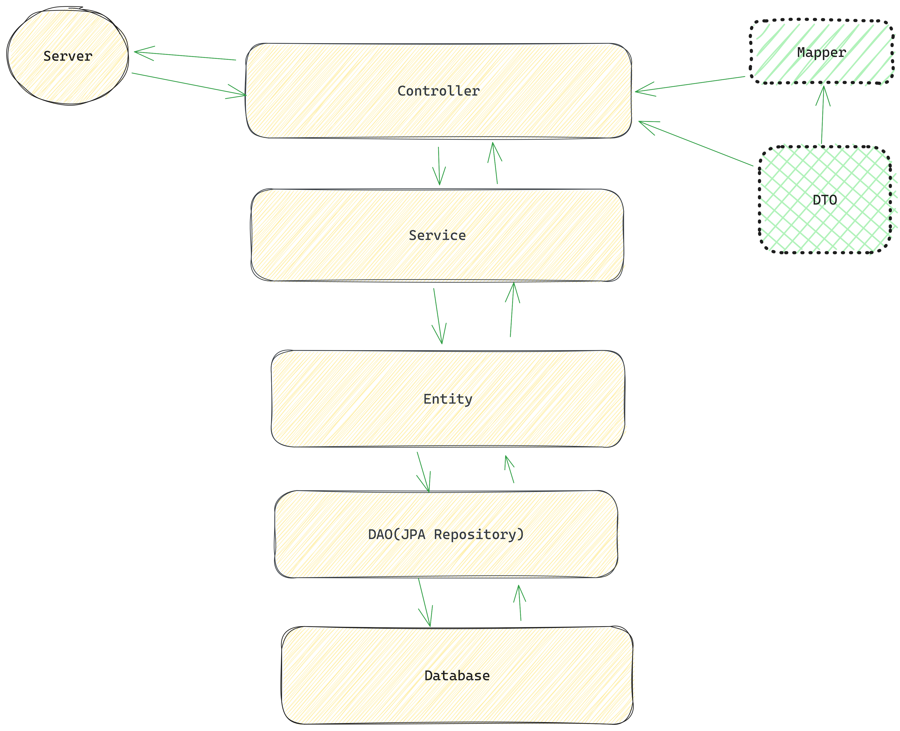

# SecurePay

SecurePay is an online payment portal that provides customers to buy goods and pay with credit card
securely via web.


## Technologies

**Language:** Java 17

**Framework:** Spring Boot 3.1.2

**Database:** PostgresSQL

**Logging:** SLF4J

**Build Automation Tool:** Maven

**Open API Specification** Swagger UI

**Encryption Type** AES/CBC/PKCS5Padding


 ### AES/CBC/PKCS5Padding Algorithm
 AES (Advanced Encryption Standard) is a widely used symmetric encryption algorithm. It's a block cipher that operates on fixed-size blocks of data and supports key lengths of 128, 192, or 256 bits. AES has become a standard encryption method due to its security, efficiency, and adoption by various industries.

CBC (Cipher Block Chaining) is a mode of operation for block ciphers like AES. In CBC mode, each block of plaintext is XORed with the previous block's ciphertext before encryption. This introduces dependency between blocks, enhancing security, and making identical plaintext blocks produce different ciphertext blocks. An Initialization Vector (IV) is used to start the chaining process, adding an element of randomness to the encryption.

PKCS5Padding is a type of padding scheme used with block ciphers to ensure that the plaintext's length is a multiple of the block size. It appends bytes to the plaintext to meet this requirement. For AES with a block size of 128 bits, PKCS5Padding ensures that the input data's length is a multiple of 16 bytes.

So, when you see AES/CBC/PKCS5Padding, it means:

    AES is the encryption algorithm being used.
    CBC is the mode of operation for AES.
    PKCS5Padding is the padding scheme used to ensure the data length is a multiple of the block size.

This combination provides secure encryption with block chaining and padding to make sure the input data is properly aligned for encryption.
## Run

For Swagger UI

```bash
  http://localhost:8080/swagger-ui/index.html#/
```

  
## Architecture
  


  
## API Usage

## Customer API

#### Save Customer

```http
  POST /api/v1/customer
```
#### Request:
| Parameter | Type     | Description               |
| :-------- | :------- | :------------------------- |
| `email` | `string` | Customer email |
| `phoneNo` | `string` | Customer phone number |
| `password` | `string` | Customer password |
| `firstName` | `string` | Customer firstName |
| `lastName` | `string` | Customer lastName |
| `identityNumber` | `string` | Customer identityNumber |
| `country` | `string` | Customer country |
| `city` | `string` | Customer city |
| `zipCode` | `string` | Customer zipCode |
| `address` | `string` | Customer address |

### Response: 
#### Success
```http
  {
  "customerId": "8f9dc7dd-2869-4b22-b204-534b6d95002f",
  "email": "email@email.com",
  "phoneNo": "+905350000000",
  "firstName": "Al",
  "lastName": "Pacino",
  "identityNumber": "74300864791",
  "country": "Turkey",
  "city": "Antalya",
  "zipCode": "07100",
  "address": "Kepez"
}
```
#### If customer saved (404)
```http
{
  Customer already registered with given email: email@email.com
}
```

#### Get All Customers

```http
  GET /api/v1/customer
```

```http
{
  [
  {
    "customerId": "8f9dc7dd-2869-4b22-b204-534b6d95002f",
    "email": "email@email.com",
    "phoneNo": "+905350000000",
    "firstName": "Al",
    "lastName": "Pacino",
    "identityNumber": "74300864791",
    "country": "Turkey",
    "city": "Antalya",
    "zipCode": "07100",
    "address": "Kepez"
  }
]
}
```
#### Get Customer By Customer Email

```http
  GET /api/v1/customer
```
| Parameter | Type     | Description               |
| :-------- | :------- | :------------------------- |
| Request Param `email` | `String` | Customer Email |

### Response: 
#### Success
```http
{
  [
  {
    "customerId": "8f9dc7dd-2869-4b22-b204-534b6d95002f",
    "email": "email@email.com",
    "phoneNo": "+905350000000",
    "firstName": "Al",
    "lastName": "Pacino",
    "identityNumber": "74300864791",
    "country": "Turkey",
    "city": "Antalya",
    "zipCode": "07100",
    "address": "Kepez"
  }
]
}
```

#### Get PaymentCard By CustomerID

```http
  GET /api/v1/customer/{customerId}/payment-card
```
| Parameter | Type     | Description               |
| :-------- | :------- | :------------------------- |
| `customerId` | `UUID` | Customer Id |

### Response: 
#### Success
```http
{
  "cardToken": "5b032148-4a6d-46d1-801b-fcae1c38ab2a",
  "cardAlias": "My Card1",
  "binNumber": "000008"
}
```


#### Get PaymentCard By Customer Email

```http
  GET /api/v1/customer/payment-card
```
| Parameter | Type     | Description               |
| :-------- | :------- | :------------------------- |
| Request Param `email` | `String` | Customer Email |

### Response: 
#### Success
```http
{
  "cardToken": "5b032148-4a6d-46d1-801b-fcae1c38ab2a",
  "cardAlias": "My Card1",
  "binNumber": "000008"
}
```
#### If customer not found given email
```http
{
  Customer not found with given email: email@emainl.com
}
```

#### Save PaymentCard By Customer Email

```http
  POST /api/v1/customer/payment-card
```
| Parameter | Type     | Description               |
| :-------- | :------- | :------------------------- |
| Request Param `email` | `String` | Customer Email|

#### RequestBody:
```http
{
  "cardAlias": "My Card1",
  "cardHolderName": "Al Pacino",
  "cardNumber": "5528790000000008",
  "expireYear": "2030",
  "expireMonth": "08",
  "cvc": "533"
}
```

### Response: 
#### Success
```http
{
  "cardToken": "5b032148-4a6d-46d1-801b-fcae1c38ab2a",
  "cardAlias": "My Card1",
  "binNumber": "000008"
}
```

#### If payment card is saved (404)
```http
{
  Payment card already registered!!
}
```
#### Save PaymentCard By CustomerID

```http
  POST /api/v1/customer/payment-card
```
| Parameter | Type     | Description               |
| :-------- | :------- | :------------------------- |
| Request Param `customerId` | `UUID` | Customer id|

#### RequestBody:
```http
{
  "cardAlias": "My Card1",
  "cardHolderName": "Al Pacino",
  "cardNumber": "5528790000000008",
  "expireYear": "2030",
  "expireMonth": "08",
  "cvc": "533"
}
```

### Response: 
#### Success
```http
{
  "cardToken": "5b032148-4a6d-46d1-801b-fcae1c38ab2a",
  "cardAlias": "My Card1",
  "binNumber": "000008"
}
```

#### If payment card is saved (404)
```http
{
  Payment card already registered!!
}
``` 

#### Delete PaymentCard By CustomerID

```http
  DELETE /api/v1/customer/{customerId}/payment-card/{cardId}
```
| Parameter | Type     | Description               |
| :-------- | :------- | :------------------------- |
| `customerId` | `UUID` | Customer id|
| `cardId` | `UUID` | Card id|


## Payment API

#### Do Payment By CustomerID

```http
  POST /api/v1/payment
```
| Parameter | Type     | Description               |
| :-------- | :------- | :------------------------- |
| Request Param `customerId` | `UUID` | Customer id|
| Request Param `registerCard` | `boolean` | If registerCard is true, save the card to the customer|

#### RequestBody:
```http
{
  "amount": 150,
  "currency": "TRY",
  "paymentCard": {
    "cardAlias": "My Card1",
  "cardHolderName": "Al Pacino",
  "cardNumber": "5528790000000008",
  "expireYear": "2030",
  "expireMonth": "08",
  "cvc": "533"
  },
  "createdAt": "2023-08-17"
}
```

### Response: 
#### Success
```http
{
  "amount": 150,
  "currency": "TRY",
  "paymentCard": {
    "id": "fb392766-abdd-4e4b-a52b-9fc63207950c",
    "cardAlias": "My Card1",
    "cardHolderName": "Al Pacino",
    "cardNumber": "5528790000000008",
    "expireMonth": "08",
    "expireYear": "2030",
    "cvc": "533"
  },
  "createdAt": "2023-08-18"
}
```
#### If amount is not greater than 0 (404)
```http
{
  Amount must be greater than 0
}
```
#### Get All Payments By Date Interval (StartDate-EndDate)

```http
  GET /api/v1/payment
```
| Parameter | Type     | Description               |
| :-------- | :------- | :------------------------- |
| Request Param `startDate` | `LocalDate` | StartDate|
| Request Param `endDate` | `LocalDate` |  EndDate|
| Request Param `page` | `int` | Page|
| Request Param `endDate` | `int` | Size|


### Response: 
#### Success
```http
{
  "content": [
    {
      "amount": 150,
      "currency": "TRY",
      "paymentCard": {
        "id": "3da842d3-e772-4c92-a4a4-a8264be391a6",
        "cardAlias": "My Card1",
        "cardHolderName": "Al Pacino",
        "cardNumber": "5528790000000008",
        "expireMonth": "08",
        "expireYear": "2030",
        "cvc": "533"
      },
      "createdAt": "2023-08-18"
    },
    {
      "amount": 150,
      "currency": "TRY",
      "paymentCard": {
        "id": "fb392766-abdd-4e4b-a52b-9fc63207950c",
        "cardAlias": "My Card1",
        "cardHolderName": "Al Pacino",
        "cardNumber": "5528790000000008",
        "expireMonth": "08",
        "expireYear": "2030",
        "cvc": "533"
      },
      "createdAt": "2023-08-18"
    }
  ],
  "pageable": {
    "sort": {
      "empty": true,
      "sorted": false,
      "unsorted": true
    },
    "offset": 0,
    "pageSize": 10,
    "pageNumber": 0,
    "unpaged": false,
    "paged": true
  },
  "last": true,
  "totalPages": 1,
  "totalElements": 2,
  "size": 10,
  "number": 0,
  "sort": {
    "empty": true,
    "sorted": false,
    "unsorted": true
  },
  "first": true,
  "numberOfElements": 2,
  "empty": false
}
```
#### Get Payments By Customer Email(StartDate-EndDate)


```http
  GET /api/v1/payment/{email}
```
| Parameter | Type     | Description               |
| :-------- | :------- | :------------------------- |
|  `email` | `String` | Customer Email|
| Request Param `startDate` | `LocalDate` | StartDate|
| Request Param `endDate` | `LocalDate` |  EndDate|
| Request Param `page` | `int` | Page|
| Request Param `endDate` | `int` | Size|


### Response: 
#### Success
```http
{
  "content": [
    {
      "amount": 22,
      "currency": "TRY",
      "paymentCard": {
        "id": "19dfc493-4a2d-48c7-a560-ccdd70d18259",
        "cardAlias": "My Card1",
        "cardHolderName": "Al Pacino",
        "cardNumber": "5528790000000008",
        "expireMonth": "08",
        "expireYear": "2030",
        "cvc": "533"
      },
      "createdAt": "2023-08-18"
    }
  ],
  "pageable": {
    "sort": {
      "empty": true,
      "sorted": false,
      "unsorted": true
    },
    "offset": 0,
    "pageNumber": 0,
    "pageSize": 10,
    "unpaged": false,
    "paged": true
  },
  "last": true,
  "totalPages": 1,
  "totalElements": 1,
  "size": 10,
  "number": 0,
  "sort": {
    "empty": true,
    "sorted": false,
    "unsorted": true
  },
  "first": true,
  "numberOfElements": 1,
  "empty": false
}
```


#### Get Payments By Customer ID

```http
  GET /api/v1/payment/customer
```
| Parameter | Type     | Description               |
| :-------- | :------- | :------------------------- |
| RequestParam `customerId` | `UUID` | Customer ID|


### Response: 
#### Success
```http
{
    "amount": 22,
    "currency": "TRY",
    "paymentCard": {
      "id": "19dfc493-4a2d-48c7-a560-ccdd70d18259",
      "cardAlias": "My Card1",
      "cardHolderName": "Al Pacino",
      "cardNumber": "5528790000000008",
      "expireMonth": "08",
      "expireYear": "2030",
      "cvc": "533"
    },
    "createdAt": "2023-08-18"
  }
```

#### Get Payments By CardNo

```http
  GET /api/v1/payment/cardNo
```
| Parameter | Type     | Description               |
| :-------- | :------- | :------------------------- |
| RequestParam `cardNumber` | `String` | Card number|


### Response: 
#### Success
```http
{
    "amount": 22,
    "currency": "TRY",
    "paymentCard": {
      "id": "19dfc493-4a2d-48c7-a560-ccdd70d18259",
      "cardAlias": "My Card1",
      "cardHolderName": "Al Pacino",
      "cardNumber": "5528790000000008",
      "expireMonth": "08",
      "expireYear": "2030",
      "cvc": "533"
    },
    "createdAt": "2023-08-18"
  }
```